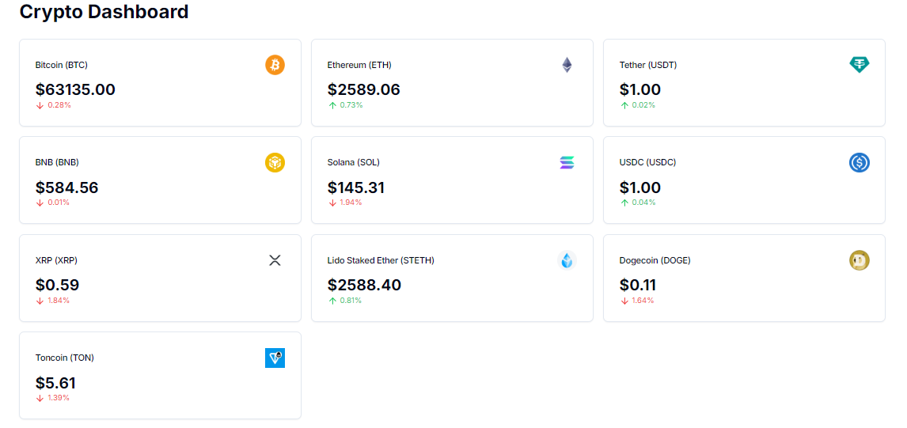

# Dashboard de Criptomoedas

Um dashboard responsivo de criptomoedas construído com Next.js, TypeScript e Tailwind CSS. Permite monitorar preços em tempo real e visualizar tendências do mercado de forma intuitiva e acessível.

## Tecnologias Utilizadas

- **Next.js**: Framework React para aplicações web.
- **TypeScript**: Superconjunto do JavaScript com tipagem estática.
- **Tailwind CSS**: Framework de CSS utilitário para estilização.

## Funcionalidades

- Visualização em tempo real dos preços das criptomoedas.
- Gráficos e tendências de mercado.
- Design responsivo, compatível com dispositivos móveis e desktops.

- git clone / npm install / npm run dev

</img>

